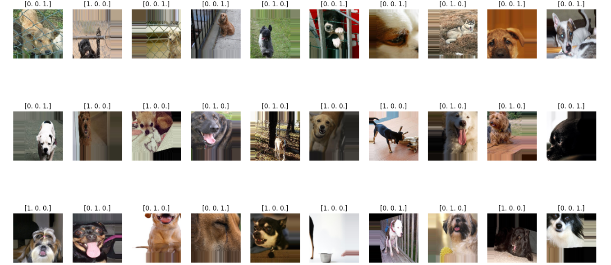

# Módulo 2

Desarrollo de aplicaciones avanzadas de ciencias computacionales TC3002B

Ariann Fernando Arriaga Alcántara A01703556

En el siguiente repositorio se alojarán todos los archivos desarrollados referentes al modelo para el Módulo 2 de la materia de Desarrollo de aplicaciones avanzadas de ciencias computacionales TC3002B

Todos los avances presentados en este repositorio se encuentran disponibles en la siguiente carpeta de Google Drive: [Módulo 2](https://drive.google.com/drive/folders/14AKGu8siQM9iV9aBoJnX9msSJgTD-qDk?usp=sharing)

# Clasificación de emociones de perros

## Dataset
El dataset seleccionado para el desarrollo de este proyecto fue creado por Daniel Shan Balico en 2023, el cual fue obtenido en la plataforma Kaggle, donde se encontró identificado como ["Dog Emotion Image Classification"](https://www.kaggle.com/datasets/danielshanbalico/dog-emotion/data)

El dataset contiene imágenes las cuales están categorizadas por clases referentes a las emociones que podría tener un perro. Dicho esto, este dataset fue construido para poderse utilizar con machine learning y generar un clasificador referente a las emociones de un perro.

La construcción del dataset fue por medio de imágenes recopiladas de varias fuentes en línea, como Kaggle y motores de búsqueda de imágenes. Y para asegurar la representatividad correcta de los datos, se seleccionaron imágenes de una variedad de razas de perros.

La estructura del dataset está por carpetas referentes a las clases de emociones:
- Angry
- Happy
- Relaxed
- Sad

Cada una de estas carpetas contiene 1000 imágenes de perros, de diferentes razas, represen entado la respectiva emoción

Para hacer la separación de los datos para poder entrenar el modelo, se dividió la estructura de la carpeta original del dataset en carpetas para el entrenamiento, validación y pruebas del modelo a construir
La separación fue hecha por medio de un script de python **DataSplit.py** el cual genera una división dada por porcentajes, en donde la carpeta **train** contiene el 70% de las imágenes del dataset y tanto la carpeta de **validation** y **test** contienen el 15% respectivamente. La división fue hecha de esa forma por lo descrito en la siguiente [fuente](https://www.baeldung.com/cs/train-test-datasets-ratio). Debido al tamaño del dataset, al ser menor de 10000 imágenes, se realizó la división 70%, 15% y 15%.

Para la división de las imágenes, se seleccionaron de manera aleatoria para poder respetar la representatividad de la muestra del dataset. 
Contando con una estructura final del conjunto de imágenes de la siguiente forma:

- **Train**
  - Angry : 700 imágenes
  - Happy : 700 imágenes
  - Relaxed : 700 imágenes
  - Sad : 700 imágenes
- **Validation**
  - Angry : 150 imágenes
  - Happy : 150 imágenes
  - Relaxed : 150 imágenes
  - Sad : 150 imágenes
- **Test**
  - Angry : 150 imágenes
  - Happy : 150 imágenes
  - Relaxed : 150 imágenes
  - Sad : 150 imágenes

## Preprocesamiento de los datos
Para poder entrenar el modelo de manera correcta se deben de preparar las imágenes para poder maximizar la posible efectividad de los resultados de este mismo.
Para el modelo presentado se utiliza ImageDataGenerator de la librería TensorFlow, dedicada a machine learnig.
Para el prepocesamiento se realizó lo siguiente para el conjunto de **train**:
- **Normalización del valor de los píxeles:** Se utilizó la propiedad de re-escalamiento que ofrece el ImageDataGenerator, esto se realiza para que los valores de un píxel este normalizado a 1, es decir ir de 0 a 1, en vez de 255
- **Redimensionamiento de las imágenes:** Para esto se definió un redimensionamiento de las imágenes del dataset a 150*150 píxeles para mantener consistencia entre los datasets.
-   **Data augmentation:** Debido al tamaño reducido del dataset, se decidió aplicar un data augmentation, que significa el transformar las imágenes del conjunto **train** del dataset, y así poder aumentar la cantidad de imágenes diferentes que recibe el modelo para su entrenamiento. Es por eso que lo aplicado para del conjunto de “train” fueron las siguientes transformaciones:
  -   **Rotation:** Se estableció un rango posible de rotación de 180 grados.
  -   **Width shift:** Se definió que se pueda modificar la imagen en su ancho, es decir, ampliarlo hasta un 30% de la imagen original.
  -   **Height shift:** Se definió que se pueda modificar la imagen en su altura, es decir, estirarlo hasta un 30% de la imagen original.
  -   **Shear:** Se estableció un rango de cizallamiento de 0.1, lo que significa que la imagen original puede ser inclinada aleatoriamente en un rango de -0.1 a 0.1 radianes.
  -   **Zoom:** Se definió un rango de acercamiento de 0.1, lo cual es referente a que la imagen original puede ser modificada al acercar la imagen hasta un 10% de su tamaño original.
  -   **Horizontal flip:** Se estableció como verdadero este parámetro, el cual indica que se puede modificar la imagen original al rotarla completamente en su eje horizontal

Cabe mencionar que para cada modificación, cuando se generan las imágenes por medio del ImageDataGenerator se puede aplicar esta modificación de manera aleatoria, es decir, cuando se genera una imagen modificada hay una probabilidad que se aplique una modificación definida previamente. Y al analizar con detenimiento las imágenes existente en el conjunto de **train**, se puede concluir que las modificaciones definidas previamente no implican un cambio en el significado de las imágenes originales. No se pierde su interpretación, por lo cual se pueden utilizar para el entrenamiento del modelo.

Otro atributo definido es el modo de clase que se aplica para la generación de imágenes, en este caso al contar con diferentes clases para la clasificación de imágenes se definió el atributo como 'categorical' para que procese las diferentes clases presentes.

Las modificaciones de preprocesamiento aplicadas para el conjunto **test** y **validation** fueron la normalización del valor de los píxeles y redimensionamiento de las imágenes, como se realizó para el conjunto **train**. Esto se realizó para que todo el conjunto de imágenes tenga cohesividad y se pueda probar de manera efectiva. Solo se aplicaron estas modificaciones para que estos conjuntos sean representativos de imágenes que se puedan encontrar en el mundo real y se pueda mostrar la efectividad del modelo con certeza.

La generación de imágenes por medio del data augmentation implica el definir un batch size, el cual es un tamaño de lote que representa el tamaño del número de imágenes nuevas que se pueden crear al llamar el generador de imágenes y que se utilizarán para entrenar el modelo. En este caso, para el preprocesador se definió un batch size de 2800 para el generador de imágenes del conjunto train y 600 para los conjuntos de **test** y **validation** respectivamente. Con esto se entrenará el modelo con un conjunto de 2800 imágenes modificadas por cada vez que se llame el generador de imágenes.

El preprocesamiento de los datos descrito se encuentra realizado en la carpeta de drive [Módulo 2](https://drive.google.com/drive/folders/14AKGu8siQM9iV9aBoJnX9msSJgTD-qDk?usp=sharing), específicamente en el archivo: **DogEmotionClassificationModel_A01703556.ipynb.** En el cual se implementó un código de lo previamente descrito en un notebook de python.

Con propósitos de demostración se mandó a llamar el generador de imágenes para el conjunto train y se guardaron los resultados en la capeta **files > augmented**. Se utilizó un batch size de 40 con el objetivo de demostrar él data augmentation aplicado para el preprocesamiento de los conjuntos de datos. Al momento de implementar el modelo se espera modificar esto y ampliar el batch size a 2800 para que se acople a las necesidades del entrenamiento.

Por último, se utilizaron las librerías de matplotlib y numpy para poder visualizar las imágenes creadas por el generador de imágenes con el lote previamente definido. Como se muestra a continuación:

# Bibliografía

A. Aylin Tokuç, “Baeldung,” Baeldung on Computer Science, Jan. 14, 2021. https://www.baeldung.com/cs/train-test-datasets-ratio (accessed May 19, 2024).
‌
