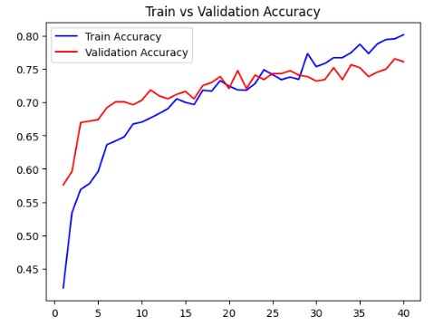
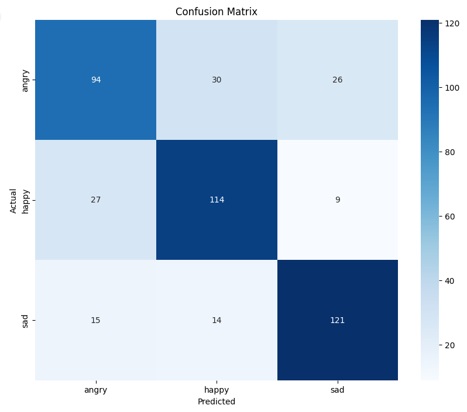
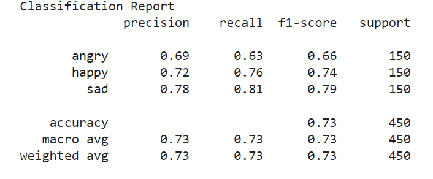

# Módulo 2

Desarrollo de aplicaciones avanzadas de ciencias computacionales TC3002B

Ariann Fernando Arriaga Alcántara A01703556

En el siguiente repositorio se alojarán todos los archivos desarrollados referentes al modelo para el Módulo 2 de la materia de Desarrollo de aplicaciones avanzadas de ciencias computacionales TC3002B

Todos los avances que se encuentran en este repositorio fueron desarrollados dentro de la siguiente carpeta de drive: [Modulo 2](https://drive.google.com/drive/folders/14AKGu8siQM9iV9aBoJnX9msSJgTD-qDk?usp=drive_link)

# Clasificación de emociones de perros

## Dataset
El dataset seleccionado para el desarrollo de este proyecto fue creado por Daniel Shan Balico en 2023, el cual fue obtenido en la plataforma Kaggle, donde se encontró identificado como ["Dog Emotion Image Classification"](https://www.kaggle.com/datasets/danielshanbalico/dog-emotion/data)

El dataset contiene imágenes las cuales están categorizadas por clases referentes a las emociones que podría tener un perro. Dicho esto, este dataset fue construido para poderse utilizar con machine learning y generar un clasificador referente a las emociones de un perro.

La construcción del dataset fue por medio de imágenes recopiladas de varias fuentes en línea, como Kaggle y motores de búsqueda de imágenes. Y para asegurar la representatividad correcta de los datos, se seleccionaron imágenes de una variedad de razas de perros.

La estructura del dataset está por carpetas referentes a las clases de emociones:
- Angry
- Happy
- Relaxed
- Sad

Cada una de estas carpetas contiene 1000 imágenes de perros, de diferentes razas, represen entado la respectiva emoción

Para hacer la separación de los datos para poder entrenar el modelo, se dividió la estructura de la carpeta original del dataset en carpetas para el entrenamiento, validación y pruebas del modelo a construir
La separación fue hecha por medio de un script de python **DataSplit.py** el cual genera una división dada por porcentajes, en donde la carpeta **train** contiene el 70% de las imágenes del dataset y tanto la carpeta de **validation** y **test** contienen el 15% respectivamente. La división fue hecha de esa forma por lo descrito en la siguiente [fuente](https://www.baeldung.com/cs/train-test-datasets-ratio). Debido al tamaño del dataset, al ser menor de 10000 imágenes, se realizó la división 70%, 15% y 15%.

Para la división de las imágenes, se seleccionaron de manera aleatoria para poder respetar la representatividad de la muestra del dataset. 
Contando con una estructura del conjunto de imágenes de la siguiente forma:

- **Train**
  - Angry : 700 imágenes
  - Happy : 700 imágenes
  - Relaxed : 700 imágenes
  - Sad : 700 imágenes
- **Validation**
  - Angry : 150 imágenes
  - Happy : 150 imágenes
  - Relaxed : 150 imágenes
  - Sad : 150 imágenes
- **Test**
  - Angry : 150 imágenes
  - Happy : 150 imágenes
  - Relaxed : 150 imágenes
  - Sad : 150 imágenes

Al realizar un análisis del conjunto de datos de las imágenes generadas, se puede observar muchas imágenes que generan ruido al momento de clasificar las emociones de los perros, ya que tanto la claseelaxed y sad generan muchas imágenes que son demasiado parecidas o se encuentran en categorías diferentes. Por lo cual basado en lo presentado por Chen, H. et al. [6]. En donde un data set con miles de imágenes fue procesado al punto de tener tres categorías de emociones de perros, basadas en las expresiones más fuertes y que se contara con un dataset limpio donde cualquier experto en el área pudiese identificar la emoción. Por lo cual los datos fueron segmentados aún más y se generó la siguiente estructura del conjunto de imágenes:

- **Train**
  - Angry : 700 imágenes
  - Happy : 700 imágenes
  - Sad : 700 imágenes
- **Validation**
  - Angry : 150 imágenes
  - Happy : 150 imágenes
  - Sad : 150 imágenes
- **Test**
  - Angry : 150 imágenes
  - Happy : 150 imágenes
  - Sad : 150 imágenes
 

Contando con un conjunto de datos de dos clases donde las imágenes en esas tres categorías que se encuentran limpias, permitiendo una mejor demostración del modelo propuesto.

## Preprocesamiento de los datos
Para poder entrenar el modelo de manera correcta se deben de preparar las imágenes para poder maximizar la posible efectividad de los resultados de este mismo. Después de realizar una investigación, K. Pal [1] describe posibles modificaciones de preprocesamiento de los datos para poder mejorar la calidad de las predicciones generadas por un modelo de clasificación de imágenes.
Para el modelo presentado se utiliza ImageDataGenerator de la librería TensorFlow, dedicada a machine learnig.
Para el prepocesamiento se realizó lo siguiente para el conjunto de **train**:
- **Normalización del valor de los píxeles:** Se utilizó la propiedad de re-escalamiento que ofrece el ImageDataGenerator, esto se realiza para que los valores de un píxel este normalizado a 1, es decir ir de 0 a 1, en vez de 255
- **Redimensionamiento de las imágenes:** Para esto se definió un redimensionamiento de las imágenes del dataset a 150*150 píxeles para mantener consistencia entre los datasets.
-   **Data augmentation:** Debido al tamaño reducido del dataset, se decidió aplicar un data augmentation, que significa el transformar las imágenes del conjunto **train** del dataset, y así poder aumentar la cantidad de imágenes diferentes que recibe el modelo para su entrenamiento. Es por eso que lo aplicado para del conjunto de “train” fueron las siguientes transformaciones:
  -   **Width shift:** Se definió que se pueda modificar la imagen en su ancho, es decir, ampliarlo hasta un 20% de la imagen original.
  -   **Height shift:** Se definió que se pueda modificar la imagen en su altura, es decir, estirarlo hasta un 20% de la imagen original.
  -   **Zoom:** Se definió un rango de acercamiento de 0.1, lo cual es referente a que la imagen original puede ser modificada al acercar la imagen hasta un 10% de su tamaño original.
  -   **Horizontal flip:** Se estableció como verdadero este parámetro, el cual indica que se puede modificar la imagen original al rotarla completamente en su eje horizontal

Cabe mencionar que para cada modificación, cuando se generan las imágenes por medio del ImageDataGenerator se puede aplicar esta modificación de manera aleatoria, es decir, cuando se genera una imagen modificada hay una probabilidad que se aplique una modificación definida previamente. Y al analizar con detenimiento las imágenes existentes en el conjunto de **train**, se puede concluir que las modificaciones definidas previamente no implican un cambio en el significado de las imágenes originales. No se pierde su interpretación, por lo cual se pueden utilizar en el entrenamiento del modelo. Con esto se busca mejorar la calidad de las predicciones y evitar problemas como el overfitting, donde el modelo se adapta a las imágenes existentes en vez de aprender.

Otro atributo definido es el modo de clase que se aplica para la generación de imágenes, en este caso al contar con diferentes clases para la clasificación de imágenes se definió el atributo como 'categorical' para que procese las diferentes clases presentes.

Las modificaciones de preprocesamiento aplicadas para el conjunto **test** y **validation** fueron la normalización del valor de los píxeles y redimensionamiento de las imágenes, como se realizó para el conjunto **train**. Esto se realizó para que todo el conjunto de imágenes tenga cohesividad y se pueda probar de manera efectiva. Solo se aplicaron estas modificaciones para que estos conjuntos sean representativos de imágenes que se puedan encontrar en el mundo real y se pueda mostrar la efectividad del modelo con certeza.

La generación de imágenes por medio del data augmentation implica el definir un batch size, el cual es un tamaño de lote que representa el tamaño del número de imágenes nuevas que se pueden crear al llamar el generador de imágenes y que se utilizarán para entrenar el modelo. En este caso, para el preprocesador se definió un batch size de 30 para el generador de imágenes del conjunto train y 30 para los conjuntos de **test** y **validation** respectivamente. Con esto se entrenará el modelo con un conjunto de 2100 imágenes modificadas por cada vez que se llame el generador de imágenes.

El preprocesamiento de los datos descrito se encuentra realizado en el archivo: **DogEmotionClassificationPreprocess.ipynb.** En el cual se implementó un código de lo previamente descrito en un notebook de python.

Con propósitos de demostración se mandó a llamar el generador de imágenes para el conjunto train y se guardaron los resultados en la capeta **files > augmented**. Se utilizó un batch size de 50 con el objetivo de demostrar él data augmentation aplicado para el preprocesamiento de los conjuntos de datos.
Por último, se utilizaron las librerías de matplotlib y numpy para poder visualizar las imágenes creadas por el generador de imágenes con el lote previamente definido. Como se muestra a continuación:

## Implementación del modelo
Para poder implementar el modelo, se utilizó transfer learning para poder generar una red neuronal convolucional que produzca predicciones más precisas y certeras. Al realizar una investigación en profundidad de los mejores modelos basados en sus resultados para la clasificación de imágenes basadas en las emociones expresadas en rostros. Lo cual es una aproximación a la temática de la clasificación de emociones de perros, M.A.H Akhand et al. [4] describen un modelo de aprendizaje profundo basado en la arquitectura VGG-16 para la detección de emociones con los mejores resultados descritos. De acuerdo a lo presentado por Sushma, L [5], la arquitectura VGG-16 representa una variante de la red VGG net, una arquitectura de Red Neuronal Convolucional (CNN) que se utilizó para ganar el concurso ILSVRC (ImageNet) en 2014.

**VGG16** es una arquitectura de Red Neuronal Convolucional (CNN) desarrollada por el Visual Geometry Group de la Universidad de Oxford. Fue utilizada para ganar el concurso ILSVRC (ImageNet) en 2014. La arquitectura VGG16 es conocida por su simplicidad y profundidad, ya que consiste en 16 capas con pesos entrenables, la razón del nombre de la arquitectura.

Características principales de VGG16:

1. **Capas Convolucionales**: Utiliza capas convolucionales con filtros de tamaño 3x3, lo que permite capturar características espaciales finas en las imágenes. Todas las convoluciones tienen un stride de 1 y el mismo padding, lo que conserva las dimensiones de las imágenes a través de las capas.

2. **Capas de Max Pooling**: Después de cada grupo de convoluciones, se utiliza una capa de max pooling con filtros de tamaño 2x2 y un stride de 2. Esto reduce las dimensiones espaciales de las características y ayuda a reducir la complejidad computacional.

3. **Capas Totalmente Conectadas**: Al final de la red, hay tres capas totalmente conectadas. Las dos primeras tienen 4096 unidades cada una y la última capa tiene un número de unidades igual al número de clases en el conjunto de datos (por ejemplo, 1000 para ImageNet).

4. **Entrada de la Red**: La red toma imágenes de entrada con dimensiones de 224x224x3 píxeles originalmente (altura, anchura, canales de color) con las modificaciones actuales se cuenta con las dimensiones 150x150x3.

Además de utilizar la arquitectura VGG-16 el modelo creado utiliza las siguientes capas con base a los artículos descritos previamente:

1. **Base model**: Es la capa base del modelo secuencial, la cual es donde está determinada la arquitectura VGG-16 descrita previamente.

2. **Flatten**:El modelo cuenta con una capa Flatten en una red neuronal que convierte una entrada multidimensional en un vector unidimensional, facilitando el procesamiento por las capas densas.

3. **Dense**: El modelo cuenta con 2 capas densas las cuales cuentan con 256 y 128 neuronas respectivamente, y las cuales cuentan con una función de activación "relu" la cual se activa si el valor de la función es positivo entonces toma el valor de la x, además de un regularizer el cual añade un término de penalización al costo del modelo. Esto se hizo para desalentar el modelo a aprender pesos grandes. Lo cual se hace para evitar el sobre ajuste.

4. **Dropout**: Entre las capas densas definidas encuentran las capas dropout las cuales omiten aleatoriamente algunas neuronas para evitar que el modelo se vuelva dependiente de cualquier neurona en particular. Con un valor de activación de 0.4 esto basándose en el trabajo descrito por Chen, H. et al. [6]

5. **Salida**: por último se genera una capa densa definida como salida con la función de activación softmax la cual genera una salida con una capa de 3 neuronas para la determinación de la del resultado de la clasificación basado en una función softmax.

### Loss
Para la función de perdida se utilizó categorical crossentropy, la cual genera un cálculo de perdida basada en como disminuye a medida que la probabilidad predicha converge hacia el label real. Mide el rendimiento de un modelo de clasificación cuya salida predicha es un valor de probabilidad entre las clases definidas.

### Función de optimización
Para la elección de la función de optimización que se utilizó es el RMSprop (Root Mean Square Propagation) el cual usa una media móvil ponderada del cuadrado de los gradientes y divide el gradiente de cada parámetro por la raíz cuadrada de esta media. Para la elección de la taza de aprendizaje se utilizó el trabajo descrito por Chen, H. et al. [6] donde se define este valor como 0.0001, dicho valor define el peso de cuanto se actualiza el resultado del ajuste del aprendizaje

Con el batchsize definido previamente se determina el número de steps que se realizan por epoch, los cuales su multiplicación deberá de dar un resultado igual al total de imágenes de set de train, o test, o validation.

Contando con el modelo implementado con la siguiente estructura:

Para este modelo inicial se definieron 40 epochs donde se analizaran sus resultados. Todo el modelo desarrollado se encuentra en el archivo del repositorio **DogEmotionClassificationModel_A01703556.ipynb** al igual que en: [Modelo](https://colab.research.google.com/drive/120kXTir0JoglEGftlPs8CDRKJGVa98m7?usp=sharing)

## Evaluación inicial del modelo
Para evaluar el modelo inicialmente se entrenó con 40 epochs con un 131 steps por epoch, y se recopilaron los datos de accuracy y loss para el train, validation y test data, basado en lo descrito por A. Hussain et al. [7] donde se obtienen los resultados de accuracy para el modelo de detección de bienestar en los perros. Describen, además de esto, 3 métricas: precisión, recall, y el puntaje F1.

Esto para evaluar el desempeño del modelo generado. Por lo tanto, en cuanto a los resultados obtenidos por el modelo previamente descrito, se obtuvieron los siguientes resultados:
### Train vs validation Accuracy

### Train vs validation Loss

### Test Accuracy y Test Loss

### Confusion Matrix

Aunado a esto, para obtener los resultados esperados de precisión, recall, y el puntaje F se requiere generar una matriz de confusión, la cual mide el desempeño de las predicciones realizadas por el modelo, donde se calcula por medio de TP, TN, FP y FN. 

- **TP (True Positive)**: Estos son los casos en los que el modelo predijo correctamente la clase positiva. Es decir, el modelo predijo que la muestra pertenece a la clase positiva, y esa predicción fue correcta cuando se compara con la verdad.

- **TN (True Negative)**: Estos son los casos en los que el modelo predijo correctamente la clase negativa. Es decir, el modelo predijo que la muestra no pertenecía a la clase positiva, y esa predicción fue correcta cuando se compara con la verdad.

- **FP (False Positive)**: Estos son los casos en los que el modelo predijo incorrectamente la clase positiva. Es decir, el modelo predijo que la muestra pertenecía a la clase positiva, pero esa predicción fue incorrecta cuando se compara con la verdad. 

- **FN (False Negative)**: Estos son los casos en los que el modelo predijo incorrectamente la clase negativa. Es decir, el modelo predijo que la muestra no pertenecía a la clase positiva, pero esa predicción fue incorrecta cuando se compara con la verdad.

### Precisión, Recall y Puntaje F1

## Análisis de los resultados obtenidos
Al analizar los resultados obtenidos al entrenar el modelo por 40 epochs se observa el valor alcanzado por el accuracy y loss de **train**, **validation** y **test** dentro de los cuales se acanzaron los siguientes resultados finales:
- **Train**:
  - Loss: 0.5170
  - Accuracy: 0.8018
- **Validation**
  - Loss: 0.60391
  - Accuracy: 0.7612
- **Test**
  - Loss: 0.7515
  - Accuracy: 0.7299
 

Al observar las diferencia del accuracy de **train** y **validation**, se observa una diferencia de **4.06%** y al compararlo con la diferencia del accuracy de **train** y **test** se observa una diferencia de **7.19%** lo cual puede ser indicativo de que se esté sobre ajustando el modelo al set de entrenamiento y esté **memorizando** ese set para obtener mejores resultados en vez de aprender, y es por eso que al comparar con test se obtiene un resultado menor.

De igual forma existe una relación de loss similar en donde cada vez va aumentando más la diferencia de loss con respecto a **train**, **validation** y **test**. El porcentaje de aumento del loss de **train** a **validation** es aproximadamente **16.81%**, y el porcentaje de aumento del **validation** a **test** es aproximadamente **24.43%**.  Los resultados al llegar a un accuracy relativamente menor con lo esperado de la capacidad de un humano promedio que se encuentra en un accuracy de 92%, se podría determinar que también no está aprendiendo de la forma en la que debería el modelo. Con esto, al visualizar la matriz de confusión se puede concluir que el modelo identifica mejor las emociones de tristeza y felicidad, pero aún confunde la emoción de enojo, con la clase felicidad. Y para los puntajes F1 se obtuvo lo siguiente:

- **Angry**: 0.66
- **Happy**: 0.74
- **Sad**: 0.79

Cuando se compara esto con la literatura investigada, se obtiene una gran diferencia, ya que en general los resultados del puntaje F1 de las clases de los modelos investigados se encuentran entre **0.75 y 0.95**

En conclusión, para esta evaluación inicial del modelo se observa la necesidad de mejorar la calidad del modelo para que aumente su tasa de accuracy en su aprendizaje, al igual que tomar futuras medidas para evitar el sobre ajuste y que mejore el accuracy de las predicciones realizadas. 
 
# Referencias bibliográficas

[1] K. K. Pal and K. S. Sudeep, "Preprocessing for image classification by convolutional neural networks," 2016 IEEE International Conference on Recent Trends in Electronics, Information & Communication Technology (RTEICT), Bangalore, India, 2016, pp. 1778-1781, doi: 10.1109/RTEICT.2016.7808140.

[2] Gu, Shanqing; Pednekar, Manisha; and Slater, Robert, "Improve Image Classification Using Data Augmentation and Neural Networks," 2019 SMU Data Science Review: Vol. 2: No. 2, Article 1. https://scholar.smu.edu/datasciencereview/vol2/iss2/1 

[3] A. Aylin Tokuç, “Baeldung,” Baeldung on Computer Science, Jan. 14, 2021. https://www.baeldung.com/cs/train-test-datasets-ratio.

[4] Akhand, M.A.H.; Roy, S.;Siddique, N.; Kamal, M.A.S.;Shimamura, T. Facial Emotion Recognition Using Transfer Learning in the Deep CNN. Electronics 2021, 10, 1036. https://doi.org/10.3390/electronics10091036

[5] Sushma, L., & Lakshmi, K. P. 2020. "An analysis of convolution neural network for image classification using different models". International Journal of Engineering Research and Technology (IJERT), 9(10).

[6] Chen, H.-Y.; Lin, C.-H.; Lai,J.-W.; Chan, Y.-K. "Convolutional Neural Network-Based Automated System for Dog Tracking and Emotion Recognition in Video Surveillance". Appl. Sci. 2023, 13,4596.https://doi.org/10.3390/app13074596

[7]A. Hussain, S. Ali, Abdullah, and H.-C. Kim, “Activity Detection for the Wellbeing of Dogs Using Wearable Sensors Based on Deep Learning,” IEEE Access, vol. 10, pp. 53153–53163, 2022, doi: https://doi.org/10.1109/ACCESS.2022.3174813.
‌
